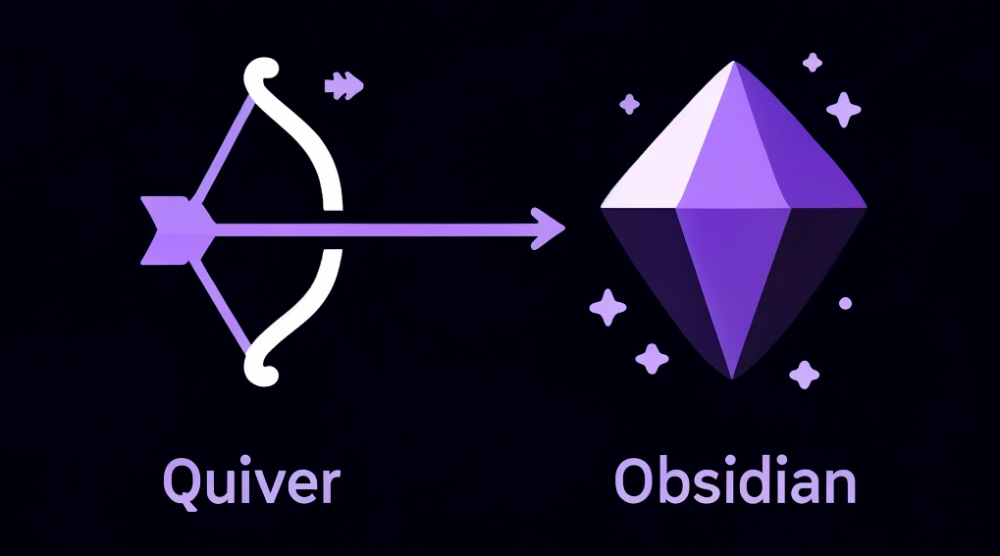

# Export Quiver library to Obsidian markdown files


The original repository can be found  [here](https://github.com/Yukaii/quiver-markdown-exporter)  
This command line tool is built upon the excellent foundation of the original repository.  
Thank you!  

---

This tool facilitates migration from Quiver to Obsidian.  
I've enhanced its features and corrected several bugs, as the original functionality did not fully meet my needs.  

Please note that both the repository name and the command name have been changed for clarity.  




* [Quiver](https://yliansoft.com/)
* [Obsidian](https://obsidian.md/)


## Installation

```bash
npm install -g quiver-to-obsidian-exporter
```

## Usage

```bash
Usage
  $ qvr2obs <input.qvlibrary> -o <output folder>  -a <Attachment folder policy>
  or
  $ qvr2obs <input.qvlibrary> -o <output folder>  -a <Attachment folder policy> -n <Attachment subfolder name if needed>

Options
  --output, -o: Output folder
  --attachmentFolderPolicy, -a: Attachment folder policy (vaultFolder, subfolderUnderVault, sameFolderAsEachFile, subfolderUnderEachFolder). 'subfolderUnderVault' and 'subfolderUnderEachFolder' require subfolder name.
  --attachmentSubfolderName, -n: Specify the subfolder name if 'subfolderUnderVault' or 'subfolderUnderEachFolder' is selected as the attachmentFolderPolicy option.

Examples
  $ qvr2obs MyNote.qvlibrary -o dest/MyNote -a vaultFolder
  $ qvr2obs MyNote.qvlibrary -o dest/MyNote -a subfolderUnderVault -n _attachments
```


## Changes from the Original

### New Features

* Output maintains the tree structure of the Quiver library (originally output was flat).
* Added support for all four Obsidian attachment folder policies.
* Converts tags, creation and modification times of notebooks into YAML front matter.
* Migrates Quiver notebooks while preserving their timestamps.
* Added a progress bar to display the transformation progress from Quiver to Obsidian.

### Bug Fixes

* Fixed an issue where image links in Markdown cells were not rendering in Obsidian.
* Sanitized characters in titles that are not allowed in Obsidian.
* Fixed LaTeX rendering issues to ensure correct display in Obsidian.

### Minor Changes

* Changed the timestamp formatter to `YYYY-MM-DD(ddd) HH:mm:ss`.
* Added a check for the existence of the qvlibrary file.
* Displays help text when executed without arguments.

### For Developers

* Added debug logging (controlled by the environment variable QUIVER_TO_OBSIDIAN_EXPORTER_LOGGING_VERBOSE).
* Created a Docker environment dedicated to testing.


## How to Test (For Developers)

This testing procedure is designed for testing in a clean environment.  
For routine testing, feel free to use your IDE of choice.  

1. Prepare the `testdata` folder:
    In the testdata folder, place xxx.qvlibrary in the sources directory, for example, and also provide a destination folder, etc. and use it as the location for the -o option (-o testdata/destination/MyNote)
2. `yarn run build`.
3. `npm pack`.
4. `docker compose up -d --build`.
5. Enter the Docker container: 
   e.g.
    ```
    docker exec -it quiver-to-obsidian-exporter-app-1 /bin/bash
	```
6.	Execute the command:
	e.g.
	```
	qvr2obs testdata/source/MyNote.qvlibrary -o testdata/destination/MyNote -a subfolderUnderVault -n _attachments
	```

If needed, enable verbose logging for debugging:
```
export QUIVER_TO_OBSIDIAN_EXPORTER_LOGGING_VERBOSE=true
```


## Contributing

If you find any bugs or have any suggestions, simply fork this repo and modify it on your own. I would probably not gonna run this repo again. 😝

Also check out the [Quiver Data format Reference](https://github.com/HappenApps/Quiver/wiki/Quiver-Data-Format).

## License

MIT
